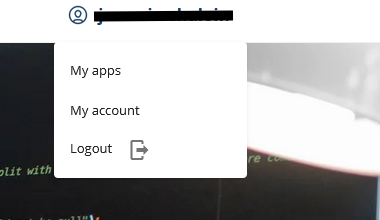
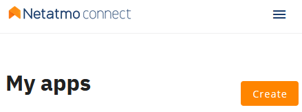
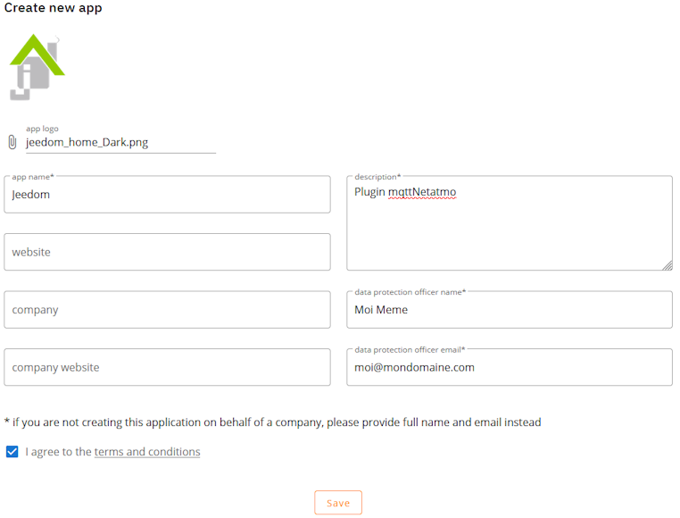
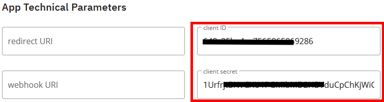
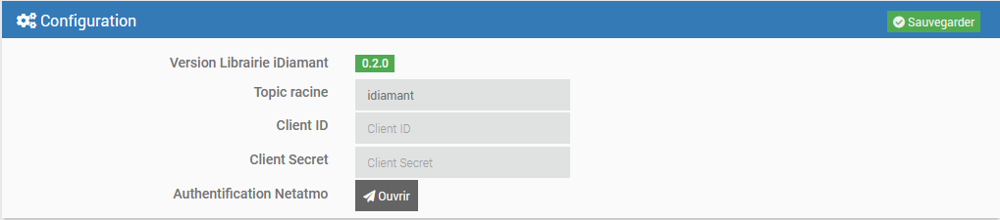
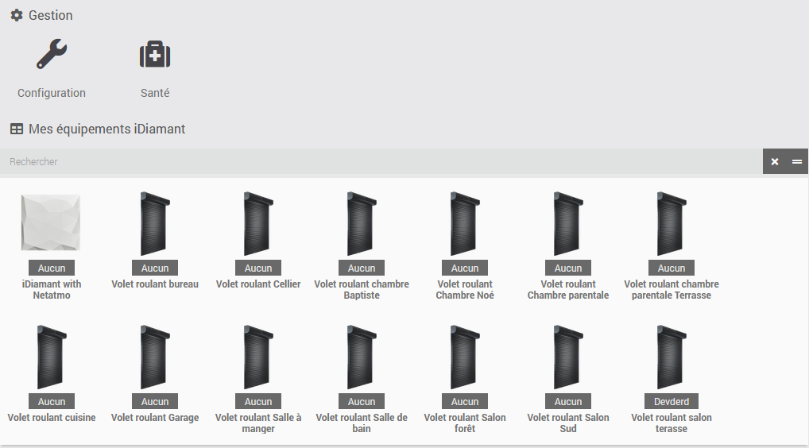
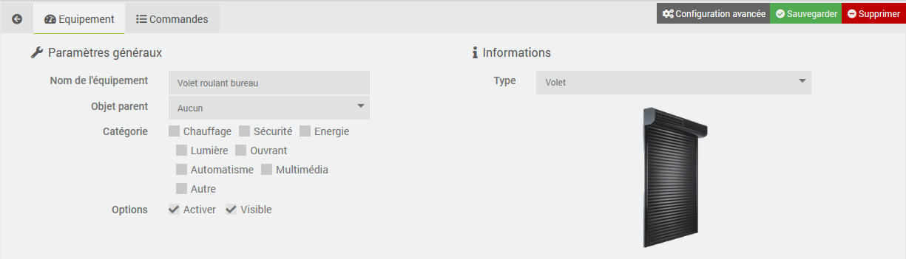
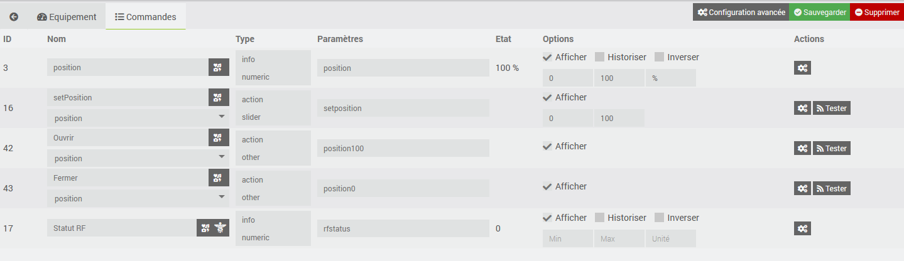

# Plugin mqttiDiamant BETA

## Description

Ce plugin permet de récuperer les données des produits Bubendorff avec la passerelle iDiamant Netatmo via MQTT.

## Pré-Requis

- Vous devez disposer d'un compte développeur Netatmo (gratuit).
- Ce plugin requiert [MQTT Manager](https://market.jeedom.com/index.php?v=d&p=market_display&id=4213), plugin officiel et gratuit.

## Installation

- Télécharger le plugin depuis le market
- Activer le plugin

# Compte Developpeur Netatmo

- Rendez-vous sur le site [dev.netatmo](https://dev.netatmo.com/)
- Créer un compte si vous n'en avez pas déjà un.
- Une fois connecté à votre compte, cliquez sur "My Apps"

- Cliquez ensute sur le bouton "Create" en haut à droite

- Remplisser le formulaire de création et cliquez sur "Save"

- Une fois le formulaire validé, vous allez voir apparaitre en bas du formulaire les deux informations dont vous allez avoir besoin pour configurer le plugin.

# Paramètres de configuration :

- **Topic racine** : Sujet racine que Jeedom doit écouter.
- **Client ID** : Information obtenue lors de l'étape précédente sur le site de Netatmo.
- **Client Secret** : Information obtenue lors de l'étape précédente sur le site de Netatmo.
- **Fréquence d'interrogation**: Fréquence d'interrogation de l'API Netatmo.
- **Identification Netatmo** : Lien vers l'authentification Netatmo.

## Configuration du compte NETATMO

- Le démon doit être démarré pour procéder à l'authentification.
- **ATTENTION** : Vous devez être connecter à votre jeedom par son adresse IP locale
- Cliquez sur "Ouvrir" : Vous arrivez sur la page d'autorisation de Netatmo
- Cliquez "OUI, J'ACCEPTE" en bas de la page.
- C'est fini !!

# Equipements

Les équipements sont accessibles à partir du menu Plugins → Objets connectés.

Les équipements sont crées lors de leur découverte par MQTT Manager.

## Configuration des équipements

En cliquant sur un équipement, vous retrouverez ses informations :

- **Nom de l’équipement** : Nom de votre équipement récupéré depuis RING.
- **Objet parent** : indique l’objet parent auquel appartient l’équipement.
- **Catégorie** : permet de chosir la catégorie de l'équipement.
- **Activer** : permet de rendre votre équipement actif.
- **Visible** : rend votre équipement visible sur le dashboard.
- **Type** : le type de module (en lecture seule).
- **Identifiant** : l'identifiant unique du module.

## Les commandes

Pour chaque équipements, vous pouvez voir les commandes créér par l'auto-découverte.

# Page santé

Le plugin dispose d'un page "Santé" qui permet de voir d'un coup d'oeil l'activité des équipements.
